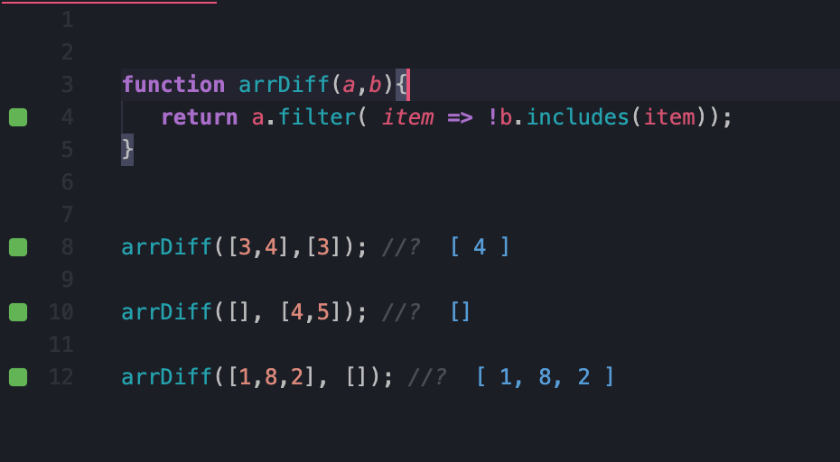

# 100 Days Of Code - Log

#### Day 0: August 4, 2020
**Today's Progress**: Created a chic digital clock using HTML/CSS/JavaScript and started working on the CSS for the analog version.

**Thoughts:** Explored the Date() method. Working out the CSS for the analog clock version is a task. Requires much more detail than the digital clock. 
 **Links to work:**   [Digital Clock](https://codepen.io/gemking1/pen/GRoVYer)   [Analog Clock](https://codepen.io/gemking1/pen/BaKaQja)

### Day 1: August 5, 2020
**Today's Progress**: Worked on finishing my analog clock and worked through some Regex exercises on www.freecodecamp.org.
**Thoughts**: It's definitely a learning process. I had to spend some time working out how to create movement of the clock arms with JS. I enjoyed exploring neumorphism for the UI/design. 
**Link to work**: [Analog clock](https://codepen.io/gemking1/pen/BaKaQja)

### Day 2: August 6, 2020
**Today's Progress**: Today I started working through a [Udemy course](https://www.udemy.com/course/build-a-quiz-app-with-html-css-and-javascript/) to learn how to build a quiz application using HTML, CSS, and JS. I started crafting the design with CSS.  
**Thoughts**: Working with CSS definitely requires a certain level of finesse 🙃 
**Link to work**: [Quiz App](https://github.com/TK1ng/quiz-app)

### Day 3: August 8, 2020
**Today's Progress**: Created a loading animation with CSS following this great [guide](https://www.freecodecamp.org/news/how-to-build-a-delightful-loading-screen-in-5-minutes-847991da509f/). Also, learned some good practices for [CSS naming conventions](https://www.freecodecamp.org/news/css-naming-conventions-that-will-save-you-hours-of-debugging-35cea737d849/) 
**Thoughts**: CSS animations are fun. 
**Link to work**: [Loading animation](https://codepen.io/gemking1/full/QWNbwNB)

### Day 4: August 9, 2020
**Today's Progress**: Started working on a magic eight ball using HTML, CSS, and JavaScript.
**Thoughts**: I took a deeper dive into trying to make the style look more realistic(a bit of the artist in me coming out). I wanted to focus on cleaning up the JavaScript here so that it isn't noisy. It's a work in progress. Still some things to tweak 
**Link to work**: [Magic 8 Ball](https://codepen.io/gemking1/pen/GRZJqJK)

### Day 5: August 10, 2020
**Today's Progress**: Completed the magic 8 ball project.
**Thoughts**: The challenge I had to overcome with this project was making the page responsive despite having html elements that have a position of absolute. The solution was adding media queries to adjust styling based on the screen size. 
**Link to work**: [Magic 8 Ball](https://codepen.io/gemking1/pen/GRZJqJK)

### Day 6: August 11, 2020
**Today's Progress**: Decided to revisit a project I've been working on. I've been building a code generator that can be used to format data inputs. 
**Thoughts**: The basic function of this tool is in place so now I am working to make improvements. One of the things I've been looking at is implementing the use of yaml parsing. This is definitely a challenge with making use of an api. 
**Links to work**:  [Code](https://github.com/TK1ng/limit-search-criteria-code-gen)  [Live](https://www.kingcodes.dev/limit-search-criteria-code-gen/)

### Day 7: August 14, 2020
**Today's Progress**: I haven't been feeling wel the past few days, so took a health break but back at it. Today I began working through a challenge from Frontend Mentor to re-create the layout of a landing page 
**Thoughts**: The tricky part for me is placement. This design has some interesting placements of elements, so this is good practice with positioning elements absolutely 
**Links to work**:  
https://github.com/TK1ng/Fylo-data-storage-component

### Day 8: August 15, 2020
**Today's Progress**: I finished a challenge from Frontend Mentor. 
**Thoughts**: Building web pages from a mobile first perspective makes the part of ensuring the page is responsive much easier. 
**Links to work**: 
[Live](http://www.kingcodes.dev/Fylo-data-storage-component/) 
[Code](https://github.com/TK1ng/Fylo-data-storage-component)

### Day 9: August 17, 2020
**Today's Progress**: I spent some time working through Javascript coding challenges from [codeWars](https://www.codewars.com) 
**Thoughts**: Once particular exercise that was a good challenge was filtering an array. The challenge was to write a function that  goal in this kata is to implement a difference function, which subtracts one list from another and returns the result. The function needed to remove all values from list a, which are present in list b.  
**Links to work**: 
<!-- 
1. [Find the Longest Word in a String](https://www.freecodecamp.com/challenges/find-the-longest-word-in-a-string)
2. [Title Case a Sentence](https://www.freecodecamp.com/challenges/title-case-a-sentence) -->
